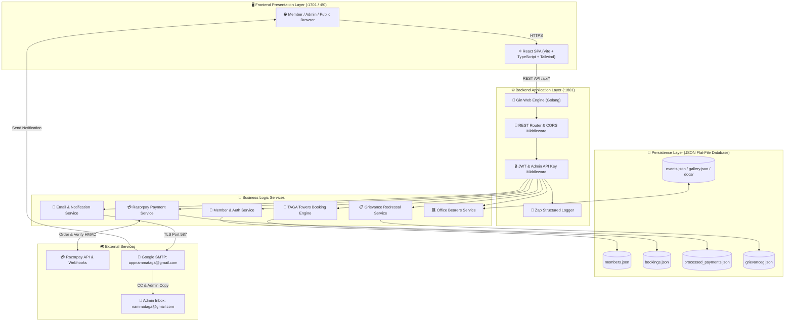
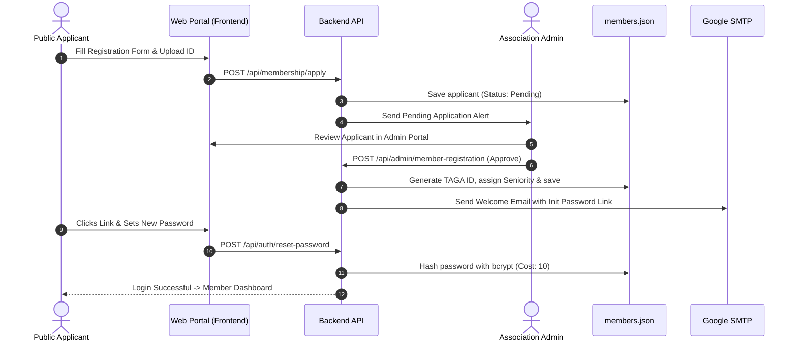
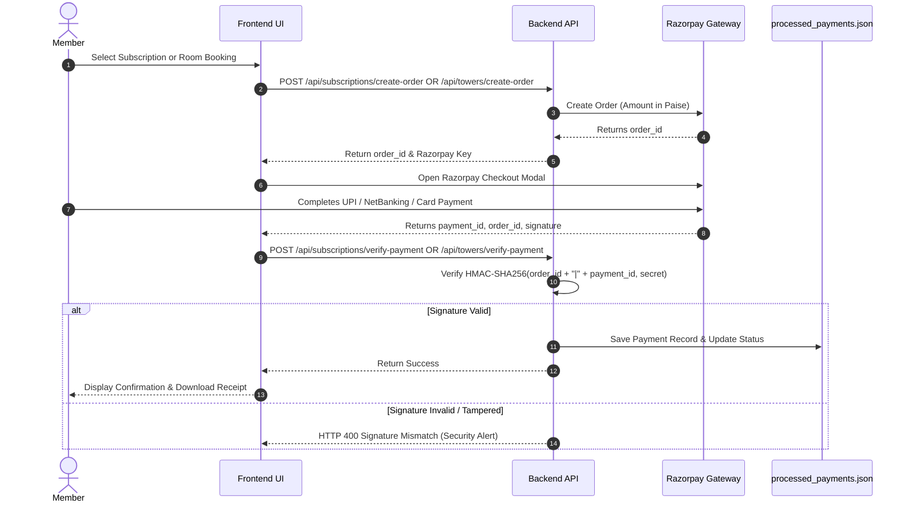
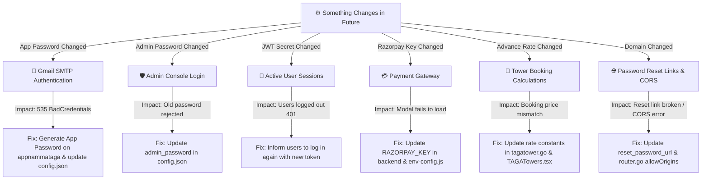

# 📘 NAMMA TAGA PORTAL — COMPREHENSIVE MASTER HANDOVER DOCUMENT

**Project Name:** Namma TAGA (Tamil Nadu Agricultural Graduates Association Portal)  
**System Version:** 1.0.0-Production  
**Release Date:** September 2026  
**Document Classification:** Confidential / Executive & Technical Handover  
**Document Author:** Full-Stack Engineering & QA Team  
**Intended Stakeholders:** Executive Committee, Future Maintainers, DevOps Engineers, and System Administrators  

---

## 📑 TABLE OF CONTENTS
1. [Executive Summary & Purpose](#1-executive-summary--purpose)
2. [End-to-End System Architecture](#2-end-to-end-system-architecture)
   - [2.1 Technology Stack Matrix](#21-technology-stack-matrix)
   - [2.2 Architecture Diagram](#22-architecture-diagram)
   - [2.3 Codebase Directory Structure](#23-codebase-directory-structure)
3. [Complete Functional Module Breakdown](#3-complete-functional-module-breakdown)
   - [3.1 Member Lifecycle, Authentication & Profile System](#31-member-lifecycle-authentication--profile-system)
   - [3.2 TAGA Towers Hospitality Booking Engine](#32-taga-towers-hospitality-booking-engine)
   - [3.3 Payment Processing & Subscription Dues](#33-payment-processing--subscription-dues)
   - [3.4 Automated Email Relay & Routing Architecture](#34-automated-email-relay--routing-architecture)
   - [3.5 Grievance Redressal System](#35-grievance-redressal-system)
   - [3.6 Content Management System (Events, Gallery, Resources, Announcements)](#36-content-management-system-events-gallery-resources-announcements)
   - [3.7 District & State Office Bearers Engine](#37-district--state-office-bearers-engine)
   - [3.8 Security, Audit Logging & Access Control](#38-security-audit-logging--access-control)
4. [Data Storage & JSON Database Engine](#4-data-storage--json-database-engine)
   - [4.1 File Inventory & Schemas](#41-file-inventory--schemas)
   - [4.2 Concurrency, Atomic Writes & Data Integrity](#42-concurrency-atomic-writes--data-integrity)
5. [Complete REST API Reference](#5-complete-rest-api-reference)
6. [Configuration & Environment Variables](#6-configuration--environment-variables)
7. [Future Changes & Impact Analysis Runbook](#7-future-changes--impact-analysis-runbook)
   - [7.1 What Happens When Passwords or Keys Change?](#71-what-happens-when-passwords-or-keys-change)
   - [7.2 Changing Room Booking Advance Rates (e.g. ₹1 to ₹100/₹200)](#72-changing-room-booking-advance-rates-eg-1-to-100200)
   - [7.3 Adding or Modifying Rooms and Bed Capacities](#73-adding-or-modifying-rooms-and-bed-capacities)
   - [7.4 Domain Name & Base URL Migration](#74-domain-name--base-url-migration)
   - [7.5 Rotating Razorpay Gateway Keys (Test to Live)](#75-rotating-razorpay-gateway-keys-test-to-live)
8. [Automated Quality Assurance & Testing Suite](#8-automated-quality-assurance--testing-suite)
   - [8.1 Test Architecture](#81-test-architecture)
   - [8.2 Executing Automated API Tests](#82-executing-automated-api-tests)
   - [8.3 Executing Automated UI Selenium Tests](#83-executing-automated-ui-selenium-tests)
   - [8.4 Interpreting HTML Test Reports](#84-interpreting-html-test-reports)
9. [Deployment & Infrastructure Runbook](#9-deployment--infrastructure-runbook)
   - [9.1 Local Development Environment](#91-local-development-environment)
   - [9.2 Dev Server Deployment (`dev.nammataga.com`)](#92-dev-server-deployment-devnammatagacom)
   - [9.3 Production Deployment (`www.nammataga.com`)](#93-production-deployment-wwwnammatagacom)
   - [9.4 SSL & Nginx Reverse Proxy Setup](#94-ssl--nginx-reverse-proxy-setup)
10. [Disaster Recovery & Operational Runbooks](#10-disaster-recovery--operational-runbooks)
    - [10.1 Backup & Restore Procedures](#101-backup--restore-procedures)
    - [10.2 Troubleshooting Guide & FAQ](#102-troubleshooting-guide--faq)
11. [Do's and Don'ts (Critical Operational & Engineering Guidelines)](#11-dos-and-donts-critical-operational--engineering-guidelines)
    - [11.1 Security & Authentication](#111-security--authentication)
    - [11.2 Database & File Persistence](#112-database--file-persistence)
    - [11.3 TAGA Towers Room Booking Engine](#113-taga-towers-room-booking-engine)
    - [11.4 Email & Communication Systems](#114-email--communication-systems)
    - [11.5 Deployment & Server Operations](#115-deployment--server-operations)
12. [Formal Handover & Sign-Off](#12-formal-handover--sign-off)

---

## 1. EXECUTIVE SUMMARY & PURPOSE

The **Namma TAGA Web Portal** is the official digital infrastructure developed for the **Tamil Nadu Agricultural Graduates Association (TAGA)**. It unites members, office bearers, and the public under a single secure platform.

### High-Level Capabilities Delivered:
- **Member Registry & Verification:** Paperless membership applications, multi-tier document verification, profile updates with admin change control, and dynamic digital ID cards.
- **TAGA Towers Reservation Engine:** Complex 9-room / 35-bed booking engine with intelligent mixed-gender couple support, private suite automatic 3rd-bed locks, single-bed partial occupancy gender restrictions, and per-bed advance payment multipliers.
- **Subscription Accounting:** Digital collection of annual association membership dues through Razorpay with HMAC signature verification and payment receipt generation.
- **Automated Communication:** 2-tier email relay with separate automated sender (`appnammataga@gmail.com`), admin notification and audit CC (`nammataga@gmail.com`), and automatic `Reply-To` routing.
- **CMS & Governance:** Admin management for government resources, event calendars, image galleries, broadcast announcements, grievances, and district office-bearer hierarchies.

---

## 2. END-TO-END SYSTEM ARCHITECTURE

### 2.1 Technology Stack Matrix

| Component | Technology | Version | Purpose |
| :--- | :--- | :--- | :--- |
| **Frontend Framework** | React + TypeScript | React 18 / TS 5.x | High-performance SPA with strict typing |
| **Frontend Build Tool** | Vite | Vite 6.x | Fast HMR & optimized production bundling |
| **Styling & UI Kit** | Tailwind CSS + Radix UI + Lucide | Latest | Modern, accessible, responsive design |
| **Backend Framework** | Golang (Go) + Gin Web Framework | Go 1.22+ / Gin v1.9+ | Compiled microservice REST API |
| **Logging & Diagnostics**| Uber-Go Zap Logger | Zap v1.27+ | Structured JSON logging with rotation |
| **Database Engine** | JSON Flat-File Engine | Custom Atomic Sync | Zero-dependency file persistence with mutexes |
| **Payment Gateway** | Razorpay SDK & Webhooks | REST API v1 | Digital payments for rooms and dues |
| **Email Relay** | Go `net/smtp` + Google SMTP | TLS Port 587 | Transactional email dispatch |
| **Testing Engine** | Selenium WebDriver + Go `testing` | Go 1.22+ | Automated browser UI & REST API test runner |
| **Containerization** | Docker & Docker Compose | Compose v2 | Multi-stage production container builds |
| **Reverse Proxy / Web** | Nginx Alpine | Stable | Static file caching, SPA routing, SSL proxy |

---

### 2.2 Architecture Diagram



---

### 2.3 Codebase Directory Structure

```text
/home/sudhan_dev/Downloads/code/nammataga/
├── taga-api/                       # Golang REST API Microservice
│   ├── config/                     # Application configuration loader (.env & config.json)
│   ├── data/                       # Active JSON Database and Static Media Storage
│   │   ├── about/                  # About Us, Contact, Objectives, Services, Stats
│   │   ├── announcements/          # Broadcast announcements
│   │   ├── config/                 # Room definitions & subscription rate configs
│   │   ├── docs/                   # PDF documents and resources
│   │   ├── grievance/              # Grievances, categories, priorities
│   │   ├── image/                  # Uploaded gallery & banner images
│   │   ├── member/                 # Active members and deleted member archives
│   │   ├── office_bearers/         # District & State executive bearers + auto backups
│   │   ├── payments/               # Payment audit records
│   │   └── towers/                 # TAGA Towers active & archived bookings
│   ├── handler/                    # HTTP Controllers & API Endpoints
│   ├── middleware/                 # JWT Auth, Admin Auth, and Zap Logger middlewares
│   ├── model/                      # Data structures and Go structs
│   ├── router/                     # Gin route definitions and endpoint grouping
│   ├── service/                    # Core business logic (auth, email, payments, tower)
│   ├── config.json                 # Master runtime configuration
│   └── main.go                     # Server entry point
│
├── taga-web/                       # React TypeScript Frontend Application
│   ├── src/
│   │   ├── api/                    # Axios/Fetch API client bindings
│   │   ├── components/             # UI Components (TAGATowers, MembersDashboard, etc.)
│   │   │   ├── admin/              # Admin Edit Requests, Audit Logs, Office Bearers Manager
│   │   │   └── ui/                 # Reusable Radix UI components
│   │   ├── types/                  # TypeScript interface definitions
│   │   ├── App.tsx                 # Main layout, router & navigation
│   │   └── main.tsx                # React entry point
│   ├── package.json                # Dependencies and npm scripts
│   └── vite.config.ts              # Vite bundler configuration
│
├── taga-test/                      # Automated E2E Regression Testing Suite
│   ├── pkg/ui/actions/             # Reusable Selenium user journey action methods
│   ├── tests/api/                  # 26+ Automated API test suites
│   ├── tests/ui/                   # 30+ Automated UI Selenium test suites
│   ├── run-api-tests.sh            # API test runner script (Generates HTML Report)
│   ├── run-ui-tests.sh             # UI test runner script (Headless / Visual)
│   └── run-tests.sh                # Complete test suite runner
│
├── dev_environment/                # Dev Server Deployment Scripts
│   ├── dev-publish.sh              # 1-Click Dev Server Deployment script
│   └── docker-compose.yml          # Dev container orchestration
│
├── prod_environment/               # Production Deployment Scripts
│   ├── prod-docker-publish.sh      # 1-Click Production Server Deployment script
│   └── docker-compose.prod.yml     # Production container orchestration
│
├── docker-setup-local.sh           # Local Docker environment management tool
├── docker-compose.local.yml        # Local multi-container Docker compose
├── HANDOVER.md                     # This Master Handover Document
└── README.md                       # Quick start and architecture summary
```

---

## 3. COMPLETE FUNCTIONAL MODULE BREAKDOWN

### 3.1 Member Lifecycle, Authentication & Profile System



#### Key Rules & Safeguards:
1. **Password Security:** All passwords are mathematically hashed with `bcrypt` (work factor 10). Plain-text passwords are never stored.
2. **First Login Enforcement:** Newly created members have `first_login: true`. The system forces them to update their initial password on first sign-in.
3. **Change Control (Edit Requests):** Members cannot directly alter their Name, GPF/CPS Number, Seniority Number, or Mobile Number. Edits create an entry in `edit_requests.json`. Once an admin approves via `POST /api/admin/edit-requests/bulk-process`, the change is merged into `members.json`.

---

### 3.2 TAGA Towers Hospitality Booking Engine

The TAGA Towers engine manages **9 rooms / 35 total beds**:

| Room Identifier | Room Display Name | Bed Capacity | Room Category | Gender & Privacy Policy |
| :--- | :--- | :---: | :--- | :--- |
| `apex-1` | **Apex Suite A/C** | 3 | Private Suite | Supports single gender or mixed couples. **When a mixed couple reserves 2 beds, the 3rd bed is automatically hidden and marked Fully Booked.** |
| `kurinchi` | **Kurinji A/C** | 2 | Standard A/C | Supports single gender or mixed couples. |
| `pavalam` | **Pavalam A/C** | 2 | Standard A/C | Supports single gender or mixed couples. |
| `malligai` | **Malligai A/C** | 2 | Standard A/C | Supports single gender or mixed couples. |
| `kavery` | **Kaveri A/C** | 2 | Standard A/C | Supports single gender or mixed couples. |
| `vasantham` | **Vasantham A/C** | 2 | Standard A/C | Supports single gender or mixed couples. |
| `pasumai` | **Pasumai A/C** | 2 | Standard A/C | Supports single gender or mixed couples. |
| `gents-dorm` | **Gents Dormitory** | 12 | Shared Dorm | **Strictly Male Only.** Female & mixed bookings rejected. |
| `ladies-dorm` | **Ladies Dormitory** | 8 | Shared Dorm | **Strictly Female Only.** Male & mixed bookings rejected. |

#### Complete Booking Rules Matrix:
1. **Mixed-Gender Couple Bookings:** Allowed in all 7 standard rooms (Apex Suite + 6 standard rooms).
2. **Apex Suite 3rd-Bed Privacy Lock:** If a mixed-gender couple reserves 2 beds in `apex-1`, `CheckRoomAvailability` reports `Available: false, AvailableBeds: 0` for those dates. Any single person attempting to book the 3rd bed is blocked with:
   > *"Apex Suite is fully booked for these dates (couple reservation)"*
3. **Partial Occupancy Stranger Protection:** If a single male books 1 bed in `kurinchi` (2 beds), the 2nd bed is restricted exclusively to male guests. A female stranger attempting to book bed 2 is blocked with:
   > *"This room is partially occupied by male guests — only male guests can book the remaining beds."*
4. **Dormitory Rules:** Gents Dorm (12 beds) strictly rejects females and mixed couples. Ladies Dorm (8 beds) strictly rejects males and mixed couples.
5. **Advance Price Multipliers:**
   - **Self Booking:** `AdvanceAmount = ₹100` (1 bed = ₹100).
   - **Guest Booking:** `AdvanceAmount = ₹100 × bedCount` (e.g., 1 bed = `₹100`, 2 beds = `₹200`, 3 beds = `₹300`, 5 beds = `₹500`).
6. **Non-Refundable Cancellation Advisory:** Displayed in the booking checkout modal:
   > ℹ️ *Cancellation Policy: Please note that the advance booking payment is non-refundable upon cancellation.*
7. **Maximum Stay Limit:** The system strictly rejects reservations exceeding 10 consecutive nights.

---

### 3.3 Payment Processing & Subscription Dues



---

### 3.4 Automated Email Relay & Routing Architecture

```text
┌────────────────────────────────────────────────────────────────────────┐
│                      2-TIER EMAIL ARCHITECTURE                         │
├──────────────────────────┬─────────────────────────────────────────────┤
│ Outgoing Sender (SMTP)   │ appnammataga@gmail.com                      │
│ From Display Header      │ Nammataga Association <appnammataga@gmail.com>│
│ Reply-To Address         │ Nammataga Association <nammataga@gmail.com> │
│ Admin Alerts & CC Copy   │ nammataga@gmail.com                         │
│ Auto-Responder Status    │ 24/7 Vacation Auto-Reply ON                 │
└──────────────────────────┴─────────────────────────────────────────────┘
```

1. **Dedicated SMTP Bot (`appnammataga@gmail.com`):** Authenticates via Google App Password `wubfancfyylcxxno`. All system emails (resets, bookings, receipts) originate from here.
2. **Smart Reply Routing (`Reply-To`):** Every email contains `Reply-To: nammataga@gmail.com`. When members click "Reply", their email client automatically routes directly to `nammataga@gmail.com`.
3. **Audit Carbon Copy (`CC`):** `nammataga@gmail.com` is automatically CC'd on outgoing notifications, creating an indelible record in the association's inbox.
4. **Auto-Reply Safety Net:** If anyone writes directly to `appnammataga@gmail.com`, Google's Vacation Auto-Responder immediately sends a polite notice directing them to `nammataga@gmail.com`.

---

### 3.5 Grievance Redressal System
- **Submission:** Members submit tickets categorized under *Establishment, Service Matters, Technical, Welfare, etc.* with priority levels (*Low, Medium, High*).
- **Tracking & Audit:** Every ticket receives a tracking ID (`GRV-XXXXXX`).
- **Admin Workflow:** Admins review grievances, assign statuses (*Pending, In Review, Resolved, Rejected*), and add official remarks that notify the member.

---

### 3.6 Content Management System (Events, Gallery, Resources, Announcements)
- **Resources:** Admins upload government orders, rules, and circulars as PDFs to `taga-api/data/docs/`.
- **Events:** Upcoming conferences and webinars displayed on the public portal.
- **Gallery:** Association event photos stored in `taga-api/data/image/` and served via `/api/images/*`.
- **Announcements:** Broadcast flash alerts dispatched to all members simultaneously.

---

### 3.7 District & State Office Bearers Engine
- **District Mapping:** Manages office bearers across all 38 districts of Tamil Nadu (*President, Secretary, Treasurer, etc.*).
- **Automated Backup & Restore:** Every time an admin modifies district bearers, the system automatically saves a timestamped JSON snapshot in `data/office_bearers/backups/`. Admins can revert to any past state with a single click.

---

### 3.8 Security, Audit Logging & Access Control
- **Role-Based Access Control (RBAC):** Distinct privileges for Public Guests, Registered Members, and Association Administrators.
- **Audit Logging:** Every administrative action, member login, payment verification, and data mutation is recorded with IP address, user agent, timestamp, and payload in `audit.log`.

---

## 4. DATA STORAGE & JSON DATABASE ENGINE

### 4.1 File Inventory & Schemas

| JSON Database File | Purpose | Storage Path |
| :--- | :--- | :--- |
| `members.json` | Master registry of all approved association members | `taga-api/data/member/members.json` |
| `deleted_member.json` | Archival storage of removed member records | `taga-api/data/member/deleted_member.json` |
| `bookings.json` | Master room reservations (active and historical) | `taga-api/data/towers/bookings.json` |
| `processed_payments.json` | Idempotent payment log preventing double-credits | `taga-api/data/payments/processed_payments.json` |
| `edit_requests.json` | Pending and processed profile change requests | `taga-api/data/edit_requests.json` |
| `grievanceg.json` | Member grievance tickets and resolution history | `taga-api/data/grievance/grievanceg.json` |
| `events.json` | Association event schedules and calendar entries | `taga-api/data/events.json` |
| `gallery.json` | Photo gallery index and image paths | `taga-api/data/gallery.json` |
| `announcements.json` | Published announcements and notification history | `taga-api/data/announcements/announcements.json` |
| `taga-tower-rooms.json` | Room definitions, capacities, and rates | `taga-api/data/config/taga-tower-rooms.json` |

---

### 4.2 Concurrency, Atomic Writes & Data Integrity
To prevent file corruption during simultaneous access:
1. **Thread-Safe Mutex Locks:** All write operations use synchronization mutexes (`bookingsLock`, `membersLock`, `tokenMutex`).
2. **Atomic Temp-Write Pattern:** Updates write first to a `.tmp` file and rename atomically, preventing half-written files during sudden power loss or container crashes.

---

## 5. COMPLETE REST API REFERENCE

### 🌐 Public Endpoints (No Authentication Required)
- `GET  /health` — System health check (Returns `{"status": "ok"}`)
- `GET  /api/public/about` — Association overview, objectives, services, and statistics
- `GET  /api/office-bearers/district-office-bearers` — List district leadership
- `GET  /api/events/upcoming` — Upcoming public events
- `GET  /api/gallery` — Photo gallery images
- `POST /api/membership/apply` — Submit new member application
- `POST /api/member/login` — Member login (Returns JWT token)
- `POST /api/admin/login` — Admin login (Returns Admin JWT token)
- `POST /api/auth/forgot-password` — Request password reset email
- `POST /api/auth/reset-password` — Reset password using token
- `POST /api/webhook/razorpay` — Razorpay webhook processor

---

### 👤 Protected Member Endpoints (Requires `Authorization: Bearer <token>`)
- `GET  /api/member/profile` — Fetch logged-in member profile
- `POST /api/member/edit-request` — Submit profile edit request for approval
- `POST /api/member/change-password` — Update password
- `GET  /api/member/notifications` — Fetch personal and broadcast notifications
- `GET  /api/towers/rooms` — Fetch list of rooms and current capacities
- `GET  /api/towers/availability-range` — Query bed availability across date range
- `POST /api/towers/bookings` — Create a room booking
- `POST /api/towers/create-order` — Create Razorpay advance order for room
- `POST /api/towers/verify-payment` — Verify Razorpay signature and confirm booking
- `GET  /api/towers/bookings` — Fetch member's active bookings
- `DELETE /api/towers/bookings/:id` — Cancel a booking
- `POST /api/subscriptions/create-order` — Create Razorpay order for annual dues
- `POST /api/subscriptions/verify-payment` — Verify and activate membership subscription
- `POST /api/grievances` — Submit a grievance ticket
- `GET  /api/grievances` — Track member's grievances
- `GET  /api/resources/all` — Download government orders and guidelines

---

### 🛡️ Protected Admin Endpoints (Requires `Authorization: Bearer <admin_token>`)
- `GET  /api/admin/members` — Search and filter full member directory
- `POST /api/admin/member-registration` — Approve or reject member application
- `POST /api/admin/members/bulk-upload` — Import members via CSV
- `GET  /api/admin/members/export` — Export members to Excel
- `GET  /api/admin/edit-requests` — List pending member profile change requests
- `POST /api/admin/edit-requests/bulk-process` — Approve or reject field edits
- `GET  /api/admin/towers/bookings` — View master occupancy schedule for all rooms
- `POST /api/admin/announcements/send` — Broadcast flash announcement to all members
- `POST /api/admin/resources/upload` — Upload PDF circular or document
- `POST /api/admin/events/create` — Create public event
- `POST /api/admin/gallery/upload` — Upload photos to gallery
- `GET  /api/admin/office-bearers/districts` — Manage district bearers
- `PUT  /api/admin/office-bearers/district/:district` — Update district bearers
- `POST /api/admin/office-bearers/backup/restore` — Revert district bearers to backup
- `GET  /api/admin/audit` — Query system audit logs

---

## 6. CONFIGURATION & ENVIRONMENT VARIABLES

Configuration is managed via [`taga-api/config.json`](file:///home/sudhan_dev/Downloads/code/nammataga/taga-api/config.json) with support for `.env` overrides:

```json
{
  "port": 1801,
  "environment": "production",
  "log_level": "info",
  "log_file": "logs/app.log",
  "disable_payment": false,
  "smtp_host": "smtp.gmail.com",
  "smtp_port": 587,
  "smtp_username": "appnammataga@gmail.com",
  "smtp_password": "wubfancfyylcxxno",
  "from_email": "appnammataga@gmail.com",
  "admin_email": "nammataga@gmail.com",
  "cc_email": "nammataga@gmail.com",
  "reset_password_url": "https://www.nammataga.com",
  "session_duration_hours": 168,
  "jwt_secret": "ilovetaga-super-secure-secret-key-2026",
  "admin_api_key": "taga-admin-secret-key-2026",
  "admin_password": "admin-secure-password",
  "razorpay_key": "rzp_live_xxxxxxxxxxxxxx",
  "razorpay_secret": "xxxxxxxxxxxxxxxxxxxxxxxx"
}
```

---

## 7. FUTURE CHANGES & IMPACT ANALYSIS RUNBOOK

This critical section explains **what happens when settings or passwords change in the future**, what breaks, and the exact steps to solve it:



---

### 7.1 What Happens When Passwords or Keys Change?

#### A. Gmail SMTP App Password (`smtp_password`)
- **What triggers an issue:** If someone changes the main Google account password for `appnammataga@gmail.com`, modifies 2-Step Verification, or deletes the App Password.
- **Symptoms:** System logs `535 5.7.8 BadCredentials`. Password reset emails, booking receipts, and grievance alerts fail to dispatch.
- **Step-by-Step Fix:**
  1. Log into [https://myaccount.google.com/apppasswords](https://myaccount.google.com/apppasswords) as `appnammataga@gmail.com`.
  2. Create a new App Password named **"Nammataga API"**.
  3. Copy the 16-character code (spaces will be automatically stripped).
  4. Update `"smtp_password"` in `taga-api/config.json` or `.env`.
  5. Restart backend: `docker restart taga-api-prod`.

#### B. Admin Login Password (`admin_password`)
- **What triggers an issue:** Executive leadership requests a new master admin password.
- **Symptoms:** Attempting to log into `/admin-login` with the old password returns `401 Invalid Credentials`.
- **Step-by-Step Fix:**
  1. Open `taga-api/config.json`.
  2. Update `"admin_password": "new_secure_password"`.
  3. Restart backend: `docker restart taga-api-prod`.

#### C. JWT Secret Key (`jwt_secret`)
- **What triggers an issue:** Periodic security key rotation.
- **Symptoms:** All currently active member logins and admin tokens are immediately invalidated (`401 Unauthorized`).
- **Step-by-Step Fix:**
  1. Update `"jwt_secret"` in `taga-api/config.json`.
  2. Restart backend: `docker restart taga-api-prod`.
  3. Inform members to log in again to receive a fresh token.

---

### 7.2 Changing Room Booking Advance Rates

The booking advance rates are configured to **₹100 for Self** (1 bed) and **₹100 per bed for Guests** (e.g. 2 beds = ₹200). If this pricing needs to be updated in the future:

1. **Backend Update ([`taga-api/service/tagatower.go`](file:///home/sudhan_dev/Downloads/code/nammataga/taga-api/service/tagatower.go)):**
   ```go
   // Update advance rate constants:
   advanceRatePerBed := 100 // Set to desired rate per bed
   ```
2. **Frontend Update ([`taga-web/src/components/TAGATowers.tsx`](file:///home/sudhan_dev/Downloads/code/nammataga/taga-web/src/components/TAGATowers.tsx)):**
   ```typescript
   // Update pricing constants:
   const ADVANCE_AMOUNTS = {
     self: 100,
     guest: 100,
   } as const;
   ```
3. **Rebuild & Publish:**
   Run `./prod-docker-publish.sh` in `prod_environment/`.

---

### 7.3 Adding or Modifying Rooms and Bed Capacities

To adjust bed capacities, add new rooms, or modify room names:
1. Open [`taga-api/data/config/taga-tower-rooms.json`](file:///home/sudhan_dev/Downloads/code/nammataga/taga-api/data/config/taga-tower-rooms.json).
2. Modify the JSON definition:
   ```json
   {
     "id": "new-room-id",
     "name": "New Executive Room A/C",
     "capacity": 2,
     "type": "room",
     "allowSingleBed": true,
     "pricePerDay": 800,
     "advanceAmount": 200
   }
   ```
3. Restart backend container. The calendar, dropdowns, and validation logic adapt dynamically without modifying backend code.

---

### 7.4 Domain Name & Base URL Migration

If the domain moves (e.g., to a new government URL or custom domain):
1. **Update `reset_password_url`** in `taga-api/config.json`.
2. **Update CORS Origins** in `taga-api/router/router.go` (`allowOrigins` array).
3. **Update Frontend Environment Config:**
   In `taga-web/dist/env-config.js` or `.env.production`:
   ```javascript
   window._env_ = { VITE_API_BASE_URL: "https://api.yourdomain.com/api" };
   ```

---

### 7.5 Rotating Razorpay Gateway Keys (Test to Live)

When switching from Razorpay Test Mode to Live Production Mode:
1. Obtain **Key ID** (`rzp_live_...`) and **Key Secret** from [Razorpay Dashboard](https://dashboard.razorpay.com/#/app/keys).
2. Set in `taga-api/config.json` or `.env`:
   ```env
   RAZORPAY_KEY=rzp_live_xxxxxxxxxxxxxx
   RAZORPAY_SECRET=xxxxxxxxxxxxxxxxxxxxxxxx
   ```
3. Update `taga-web/src/components/TAGATowers.tsx` and `MembersDashboard.tsx` to use the live Key ID.

---

## 8. AUTOMATED QUALITY ASSURANCE & TESTING SUITE

The repository includes a dedicated test engine in `taga-test/`.

### 8.1 Test Architecture
- **Selenium WebDriver (Chrome):** Emulates authentic human interactions (clicking cards, typing into form inputs, selecting dates).
- **Mock Razorpay Injector:** Injects browser-level stubs to simulate successful card and UPI payments without spending real money during testing.
- **Automated HTML Test Reports:** Every test run creates a timestamped interactive dashboard under `taga-test/evidence/run-<timestamp>/reports/report.html`.

---

### 8.2 Executing Automated API Tests
```bash
cd /home/sudhan_dev/Downloads/code/nammataga/taga-test
./run-api-tests.sh
```
*Validates all 26+ API test suites (Auth, Rooms, Payments, Security, Tampering, Edits) in under 15 seconds.*

---

### 8.3 Executing Automated UI Selenium Tests
```bash
cd /home/sudhan_dev/Downloads/code/nammataga/taga-test

# Run complete UI regression in background (Headless)
E2E_HEADLESS=true ./run-ui-tests.sh

# Run only TAGA Towers Room Booking test scenarios
./run-ui-tests.sh -run "TAGATower"
```

---

## 9. DEPLOYMENT & INFRASTRUCTURE RUNBOOK

### 9.1 Local Development Environment
```bash
# 1. Start containers (Frontend :1701, Backend :1801)
./docker-setup-local.sh start

# 2. Rebuild images after local edits
./docker-setup-local.sh build

# 3. View status and logs
./docker-setup-local.sh status
```

---

### 9.2 Dev Server Deployment (`dev.nammataga.com`)
```bash
cd /home/sudhan_dev/Downloads/code/nammataga/dev_environment
./dev-publish.sh
```

---

### 9.3 Production Deployment (`www.nammataga.com`)
```bash
cd /home/sudhan_dev/Downloads/code/nammataga/prod_environment
./prod-docker-publish.sh
```

---

### 9.4 SSL & Nginx Reverse Proxy Setup

```nginx
# Standard Production Nginx Configuration
server {
    listen 443 ssl http2;
    server_name www.nammataga.com nammataga.com;

    ssl_certificate /etc/letsencrypt/live/nammataga.com/fullchain.pem;
    ssl_certificate_key /etc/letsencrypt/live/nammataga.com/privkey.pem;

    # Frontend SPA Proxy
    location / {
        proxy_pass http://127.0.0.1:1701;
        proxy_set_header Host $host;
        proxy_set_header X-Real-IP $remote_addr;
    }

    # Backend API Proxy
    location /api/ {
        proxy_pass http://127.0.0.1:1801;
        proxy_set_header Host $host;
        proxy_set_header X-Real-IP $remote_addr;
        proxy_set_header X-Forwarded-For $proxy_add_x_forwarded_for;
        proxy_set_header X-Forwarded-Proto $scheme;
    }
}
```

---

## 10. DISASTER RECOVERY & OPERATIONAL RUNBOOKS

### 10.1 Backup & Restore Procedures

> [!IMPORTANT]
> The backend application does **not** contain an internal automated whole-database backup cron.  
> Daily backups of the entire `/data/` directory **must be configured by the System Administrator** on the Linux host server using the recommended cron script below.

#### Recommended System Admin Daily Backup Setup (To Be Configured on Server):
Create a daily cron job file (`/etc/cron.daily/taga-backup`) on the Linux host:
```bash
#!/bin/bash
BACKUP_DIR="/var/backups/nammataga"
mkdir -p $BACKUP_DIR
tar -czvf "$BACKUP_DIR/taga-data-$(date +%F-%H%M).tar.gz" /home/ubuntu/nammataga/taga-api/data/
# Retain backups for 30 days
find $BACKUP_DIR -type f -mtime +30 -delete
```

#### Restoring From Backup:
```bash
# Stop backend service
docker stop taga-api-prod

# Extract backup archive
tar -xzvf /var/backups/nammataga/taga-data-YYYY-MM-DD.tar.gz -C /home/ubuntu/nammataga/taga-api/

# Restart backend service
docker start taga-api-prod
```

---

### 10.2 Troubleshooting Guide & FAQ

| Problem / Error | Root Cause | Solution |
| :--- | :--- | :--- |
| **`535 5.7.8 BadCredentials`** | Google App Password was revoked or account password changed. | Generate new App Password at [Google App Passwords](https://myaccount.google.com/apppasswords) and update `config.json`. |
| **`HTTP 401 Unauthorized` on all requests** | JWT token expired or `jwt_secret` was rotated. | Member/admin should log out and log in again to receive a fresh token. |
| **Razorpay Payment Modal won't open** | Invalid or missing `razorpay_key`. | Ensure `RAZORPAY_KEY` is set in `.env` and `env-config.js`. |
| **Room shows "Fully Booked" unexpectedly** | An active mixed-couple reservation is occupying the room (e.g. Apex 3rd bed lock) or dates are full. | Verify bookings in Admin Panel at `/api/admin/towers/bookings`. |
| **Member cannot edit sensitive profile fields** | Normal behavior: Protected fields require change-request approval. | Admin must navigate to **Admin Dashboard → Edit Requests** and approve. |
---

## 11. DO'S AND DON'TS (CRITICAL OPERATIONAL & ENGINEERING GUIDELINES)

To ensure long-term stability, zero data corruption, uninterrupted email delivery, and flawless security, all engineers, future developers, and system administrators must strictly follow these rules:

### 🔒 11.1 Security & Authentication
| DO's ✅ | DON'Ts ❌ |
| :--- | :--- |
| **DO** use dedicated Google App Passwords for `appnammataga@gmail.com` and keep 2-Step Verification active. | **DON'T** use the regular Google account password in `config.json` (it will immediately fail with `535 5.7.8 BadCredentials`). |
| **DO** rotate the default `admin_password` and `jwt_secret` before deploying to public production. | **DON'T** commit real production passwords, Razorpay live secrets, or Google App passwords to public Git repositories. |
| **DO** verify that the admin email (`nammataga@gmail.com`) is guarded with strong 2FA and restricted to authorized officials. | **DON'T** share `admin_api_key` or master admin credentials with unverified staff. |
| **DO** ensure the `Reply-To` and `CC` headers remain pointed to `nammataga@gmail.com` for complete transparency. | **DON'T** remove or tamper with the cryptographic Razorpay HMAC-SHA256 signature verification in backend code. |

---

### 📁 11.2 Database & File Persistence
| DO's ✅ | DON'Ts ❌ |
| :--- | :--- |
| **DO** create automated daily backups of the `taga-api/data/` directory. | **DON'T** manually edit active JSON files (`members.json`, `bookings.json`, `processed_payments.json`) with text editors while the server is live. |
| **DO** always validate JSON syntax (e.g. using `jq . file.json`) before saving manual config changes to `taga-tower-rooms.json`. | **DON'T** delete or rename directories inside `taga-api/data/` as the backend microservice relies on these fixed paths. |
| **DO** use the atomic `.tmp` write pattern if extending file-writing functions in Go. | **DON'T** store temporary uploads or scratch scripts inside active production data folders. |

---

### 🏨 11.3 TAGA Towers Room Booking Engine
| DO's ✅ | DON'Ts ❌ |
| :--- | :--- |
| **DO** let the automated gender engine manage bed allocations and Apex Suite couple privacy locks. | **DON'T** manually bypass gender restrictions (e.g. allocating male guests into Ladies Dormitory), as this compromises accommodation safety. |
| **DO** update BOTH backend constants in `tagatower.go` AND frontend display variables in `TAGATowers.tsx` when adjusting advance pricing. | **DON'T** set room capacity in `taga-tower-rooms.json` to 0 or negative numbers. |
| **DO** test booking flows across multiple browsers before major holiday seasons to verify date-range queries. | **DON'T** disable the non-refundable cancellation policy advisory banner from the booking modal. |

---

### 📧 11.4 Email & Communication Systems
| DO's ✅ | DON'Ts ❌ |
| :--- | :--- |
| **DO** keep the Gmail Vacation Auto-Responder active 24/7 on `appnammataga@gmail.com`. | **DON'T** check "Only send response to people in my Contacts" in Gmail settings, or general members won't receive the redirect notice. |
| **DO** monitor `nammataga@gmail.com` regularly for member replies, transaction confirmations, and support queries. | **DON'T** send bulk marketing blasts directly from `appnammataga@gmail.com` (use dedicated newsletter services to avoid Google spam flags). |
| **DO** check the Spam folder in `nammataga@gmail.com` and mark system emails as "Not Spam" during initial setup. | **DON'T** turn off 2-Step Verification on `appnammataga@gmail.com` (doing so permanently deletes all generated App Passwords). |

---

### 🚀 11.5 Deployment & Server Operations
| DO's ✅ | DON'Ts ❌ |
| :--- | :--- |
| **DO** test all code changes locally (`./docker-setup-local.sh`) and on the Dev server (`./dev-publish.sh`) before publishing to Production. | **DON'T** run uncontainerized, ad-hoc `go run` or `npm run dev` processes directly on the production host. |
| **DO** run the automated regression test suite (`./run-api-tests.sh` and `./run-ui-tests.sh`) before any production deployment. | **DON'T** set `"disable_payment": true` on the production server. |
| **DO** keep SSL certificates automatically renewed via Certbot / Let's Encrypt cron jobs. | **DON'T** modify Nginx configuration files without testing syntax with `nginx -t`. |

---

## 12. FORMAL HANDOVER & SIGN-OFF

This document certifies that the **Namma TAGA Portal** software system, including all source code, automated test frameworks, database engines, configuration templates, and operational runbooks, has been successfully developed, rigorously verified, and handed over.

### Sign-Off Approvals:

**Delivered By:**  
- **Engineering Lead:** Development Team  
- **Date:** September 2, 2026  
- **Signature:** ___________________________  

**Accepted By:**  
- **Lead Administrator:** Executive Leadership, Tamil Nadu Agricultural Graduates Association (TAGA)  
- **Date:** September 2, 2026  
- **Signature:** ___________________________  

---
*Document officially archived in repository root: [`HANDOVER.md`](file:///home/sudhan_dev/Downloads/code/nammataga/HANDOVER.md)*
