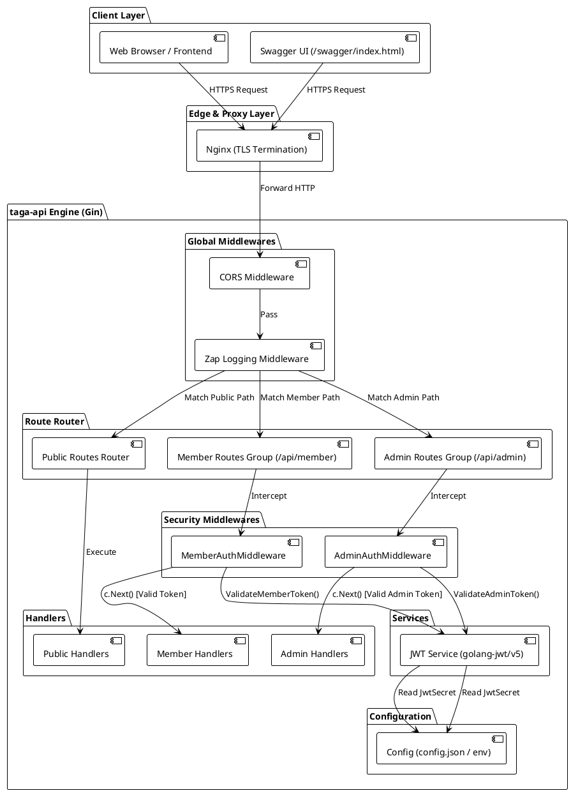
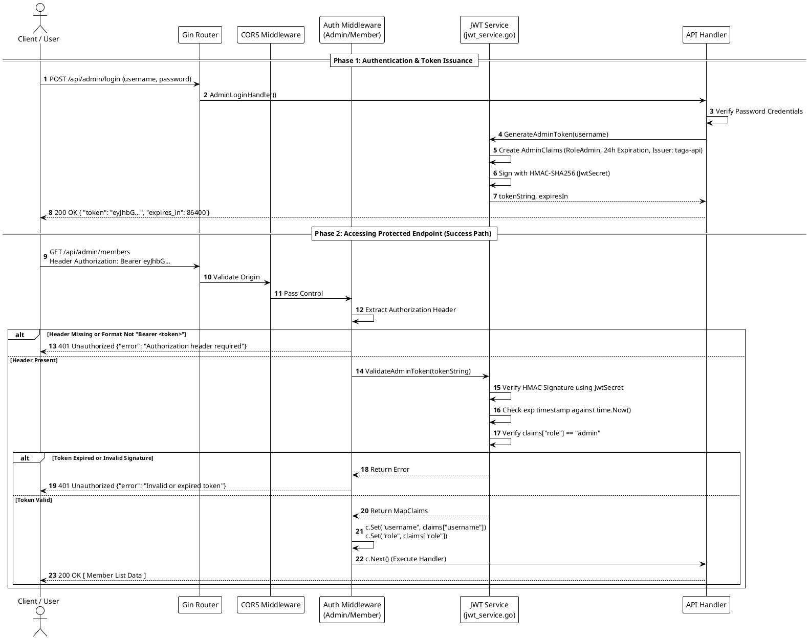

# Security Architecture & Design Specification: `taga-api`

This document details the security architecture, middleware execution pipeline, JWT token lifecycle, Swagger OpenAPI annotations, configuration settings, and Security Architect recommendations for **`taga-api`**.

---

## 1. Security Architecture Overview

`taga-api` uses a **Role-Based Access Control (RBAC)** architecture powered by the Gin Web Framework and JSON Web Tokens (JWT). The API segregates access into three security zones:

1. **Public Zone**: Unauthenticated endpoints accessible by general clients (e.g., public info, events, gallery, public resources, webhooks).
2. **Member Zone**: Endpoints requiring a valid `RoleMember` JWT token issued upon member login (e.g., member profile, notifications, payments, subscriptions).
3. **Admin Zone**: Endpoints requiring a valid `RoleAdmin` JWT token (e.g., member management, content updates, reports, backup & restore).

```
 +---------------------------------------------------------------------------------------------------+
 |                                      INCOMING HTTP REQUEST                                        |
 +---------------------------------------------------------------------------------------------------+
                                                  |
                                                  v
 +---------------------------------------------------------------------------------------------------+
 | 1. CORS Middleware (cors.New)                                                                     |
 |    - Validates Origin against AllowedOrigins (Production whitelist vs Dev wildcard '*')          |
 |    - Enforces allowed headers: Authorization, Content-Type, Origin, Accept                         |
 +---------------------------------------------------------------------------------------------------+
                                                  |
                                                  v
 +---------------------------------------------------------------------------------------------------+
 | 2. Structured Logging Middleware (GinZapLogger)                                                   |
 |    - Captures request metadata, client IP, latency, HTTP method, and path                          |
 +---------------------------------------------------------------------------------------------------+
                                                  |
                                                  v
 +---------------------------------------------------------------------------------------------------+
 | 3. Gin Engine Router (router.SetupRouter())                                                       |
 |    - Matches request path to route definition and route group                                      |
 +---------------------------------------------------------------------------------------------------+
                           /                                      \
                          /                                        \
                         v                                          v
 +-----------------------------------+                    +------------------------------------+
 | Public Routes (No Auth)           |                    | Protected Route Groups             |
 | - /api/public/*                   |                    | - /api/member/*                    |
 | - /api/events/*                   |                    | - /api/payments/*                  |
 | - /api/webhook/razorpay           |                    | - /api/admin/*                     |
 +-----------------------------------+                    +------------------------------------+
                   |                                                        |
                   v                                                        v
         [Execute Handler]                                +------------------------------------+
                                                          | Auth Middleware                    |
                                                          | (AdminAuth / MemberAuth)           |
                                                          | 1. Extract Bearer Token            |
                                                          | 2. Validate Signature (HS256)      |
                                                          | 3. Check Expiration & Issuer       |
                                                          | 4. Validate Required Role          |
                                                          | 5. Inject Claims into Gin Context  |
                                                          +------------------------------------+
                                                                    |                 |
                                                               Valid|                 |Invalid
                                                                    v                 v
                                                          [Execute Handler]   [401 Unauthorized]
```

---

## 2. Middleware Execution Pipeline & Order

When an HTTP request enters `taga-api`, it passes through middlewares in a strict sequential order defined in [`router.go`](file:///home/ubuntu/code/github/raviautopilot/nammataga/taga-api/router/router.go#L26-L267):

| Order | Component / Middleware | Target Path | Responsibility / Behavior |
| :---: | :--- | :--- | :--- |
| **1** | `cors.New(...)` | Global (`r.Use`) | Cross-Origin Resource Sharing check. Evaluates request origin against allowed list and sets pre-flight `OPTIONS` headers. |
| **2** | `middleware.GinZapLogger()` | Global (`r.Use`) | Logs structured HTTP access details using Uber Zap logger. |
| **3** | Unauthenticated Handlers | `/`, `/health`, `/api/public/*`, `/api/webhook/*` | Direct handler execution without authentication header requirement. |
| **4** | Auth Issuance Routes | `/api/member/login`, `/api/admin/login`, `/api/auth/*` | Verifies credentials against DB/config and generates signed JWT tokens via `jwt_service.go`. |
| **5** | `middleware.MemberAuthMiddleware()` | Route Group: `/api/member/*`, `/api/payments/*`, `/api/subscriptions/*` | Inspects `Authorization: Bearer <token>`, validates member claims, injects `member_id`, `member_email`, `member_name`, `role` into Gin context. Returns `401 Unauthorized` on failure. |
| **6** | `middleware.AdminAuthMiddleware()` | Route Group: `/api/admin/*` | Inspects `Authorization: Bearer <token>`, validates admin claims, verifies `role == "admin"`, injects `username`, `userID`, `role` into Gin context. Returns `401 Unauthorized` on failure. |

---

## 3. PlantUML Architecture & Sequence Diagrams

### 3.1 PlantUML Component Diagram: Security Architecture



---

### 3.2 PlantUML Sequence Diagram: JWT Authentication & Request Flow



---

## 4. Swagger (OpenAPI) Security Annotations

Swagger documentation in `taga-api` uses annotations provided by `swaggo/swag`.

### 4.1 Global Security Definition
The global API security scheme is defined at the top of [`taga-api/router/router.go`](file:///home/ubuntu/code/github/raviautopilot/nammataga/taga-api/router/router.go#L20-L23):

```go
// @securityDefinitions.apikey BearerAuth
// @in header
// @name Authorization
// @description Type "Bearer" followed by a space and the JWT token.
```

- **`@securityDefinitions.apikey`**: Defines an API key authentication scheme named `BearerAuth`.
- **`@in header`**: Instructs Swagger UI to pass the credential in HTTP Request Headers.
- **`@name Authorization`**: Sets the header key to `Authorization`.

### 4.2 Handler Security Annotation
To declare that an individual API route requires JWT authorization, add `@Security BearerAuth` to the handler docstrings (e.g. in [`taga-api/handler`](file:///home/ubuntu/code/github/raviautopilot/nammataga/taga-api/handler)):

```go
// GetMembersList retrieves all registered members
// @Summary List Members
// @Description Retrieve a list of members filtered by district or status
// @Tags Admin
// @Accept json
// @Produce json
// @Security BearerAuth
// @Success 200 {array} model.Member
// @Failure 401 {object} map[string]string "Unauthorized"
// @Router /api/admin/members [get]
func GetMembersList(c *gin.Context) {
    // Handler implementation
}
```

### 4.3 Generating & Serving Swagger Spec
1. Run `swag init` in `taga-api/` to scan annotations and regenerate `docs/swagger.json` and `docs/swagger.yaml`.
2. `taga-api/router/router.go` mounts the UI handler at line 266:
   ```go
   r.GET("/swagger/*any", ginSwagger.WrapHandler(swaggerFiles.Handler))
   ```
3. Access Swagger UI at `https://<domain>/swagger/index.html` and click **Authorize** to input `Bearer <jwt_token>`.

---

## 5. File & Configuration Responsibility Matrix

| File Path | Core Responsibility | Security Features |
| :--- | :--- | :--- |
| [`taga-api/config/config.json`](file:///home/ubuntu/code/github/raviautopilot/nammataga/taga-api/config/config.json) | Application runtime configuration | Stores `jwt_secret` and environment mode (`development`/`staging`/`production`). |
| [`taga-api/service/jwt/constants.go`](file:///home/ubuntu/code/github/raviautopilot/nammataga/taga-api/service/jwt/constants.go) | Role definitions & token lifetime helper | Defines `RoleAdmin` ("admin"), `RoleMember` ("member"), and environment-based TTLs. |
| [`taga-api/service/jwt/claims.go`](file:///home/ubuntu/code/github/raviautopilot/nammataga/taga-api/service/jwt/claims.go) | JWT Claim structures | Implements `AdminClaims` and `MemberClaims` extending `jwt.RegisteredClaims`. |
| [`taga-api/service/jwt/jwt_service.go`](file:///home/ubuntu/code/github/raviautopilot/nammataga/taga-api/service/jwt/jwt_service.go) | Cryptographic signing & parsing | Signs tokens with HMAC-SHA256 (`SigningMethodHS256`), parses tokens, and enforces explicit expiration checks. |
| [`taga-api/middleware/admin_auth.go`](file:///home/ubuntu/code/github/raviautopilot/nammataga/taga-api/middleware/admin_auth.go) | Admin Authorization Guard | Extracts Bearer token, validates admin claims, and injects `username`, `userID`, and `role` into Gin context. |
| [`taga-api/middleware/member_auth.go`](file:///home/ubuntu/code/github/raviautopilot/nammataga/taga-api/middleware/member_auth.go) | Member Authorization Guard | Extracts Bearer token, validates member claims, and injects `member_id`, `member_email`, `member_name`, and `role`. |
| [`taga-api/router/router.go`](file:///home/ubuntu/code/github/raviautopilot/nammataga/taga-api/router/router.go) | Central Route Assembly & CORS | Applies CORS whitelist, mounts Zap logger, groups routes, attaches auth middlewares, and exposes `/swagger/*any`. |

---

## 6. Security Architect Recommendations & Improvements

> [!WARNING]
> The following security enhancement recommendations should be prioritized to strengthen `taga-api` against production security threats.

### 6.1 Eliminate Hardcoded Fallback JWT Secrets
* **Current Issue**: In [`jwt_service.go`](file:///home/ubuntu/code/github/raviautopilot/nammataga/taga-api/service/jwt/jwt_service.go#L18), if `cfg.JwtSecret` is empty, it falls back to `"ilovetaga"`.
* **Risk**: If configuration loading fails in production, the API defaults to a publicly exposed secret key, allowing attackers to forge arbitrary admin tokens.
* **Recommendation**: Enforce a strict startup check in `config.InitConfig()`:
  ```go
  if (cfg.Environment == "production" || cfg.Environment == "staging") && cfg.JwtSecret == "" {
      log.Fatalf("FATAL SECURITY ERROR: JwtSecret must be configured in %s environment", cfg.Environment)
  }
  ```

### 6.2 Implement Rate Limiting Middleware
* **Current Issue**: Login endpoints (`/api/admin/login`, `/api/member/login`, `/api/auth/forgot-password`) lack request rate limiting.
* **Risk**: Vulnerable to credential stuffing and brute-force password guessing attacks.
* **Recommendation**: Attach an IP-based rate limiter (e.g. `golang.org/x/time/rate`) to authentication routes:
  ```go
  authGroup.Use(middleware.RateLimiter(5, time.Minute)) // Max 5 attempts per minute
  ```

### 6.3 Token Blacklisting / Instant Revocation Mechanism
* **Current Issue**: JWT tokens are stateless and remain valid until their expiration time (`exp`). Logout endpoints (`/api/member/logout`) cannot invalidate issued tokens server-side.
* **Risk**: Stolen tokens remain active even after a user logs out or changes their password.
* **Recommendation**: Integrate Redis-backed token revocation list (JTI / Token hash blacklist) checked inside `AdminAuthMiddleware` and `MemberAuthMiddleware`.

### 6.4 OWASP Security Headers Middleware
* **Current Issue**: Default HTTP responses lack security headers such as `X-Frame-Options`, `X-Content-Type-Options`, and `Strict-Transport-Security`.
* **Recommendation**: Add a Security Headers middleware to `router.go`:
  ```go
  r.Use(func(c *gin.Context) {
      c.Header("X-Frame-Options", "DENY")
      c.Header("X-Content-Type-Options", "nosniff")
      c.Header("X-XSS-Protection", "1; mode=block")
      c.Header("Strict-Transport-Security", "max-age=31536000; includeSubDomains")
      c.Next()
  })
  ```
