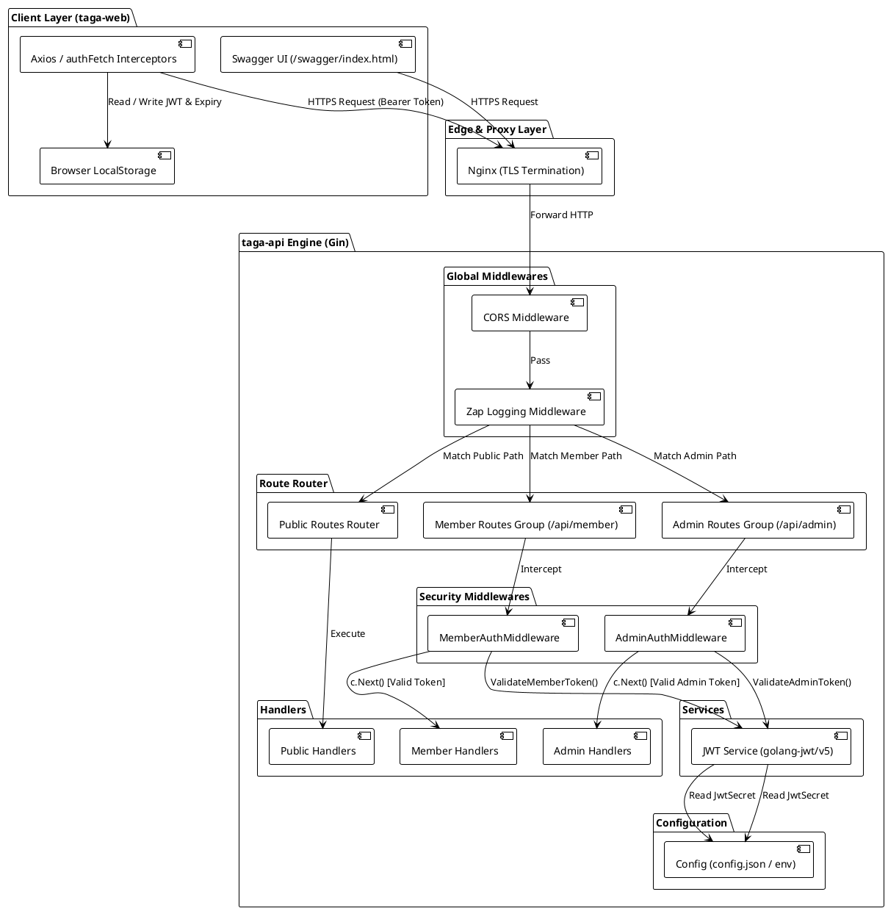
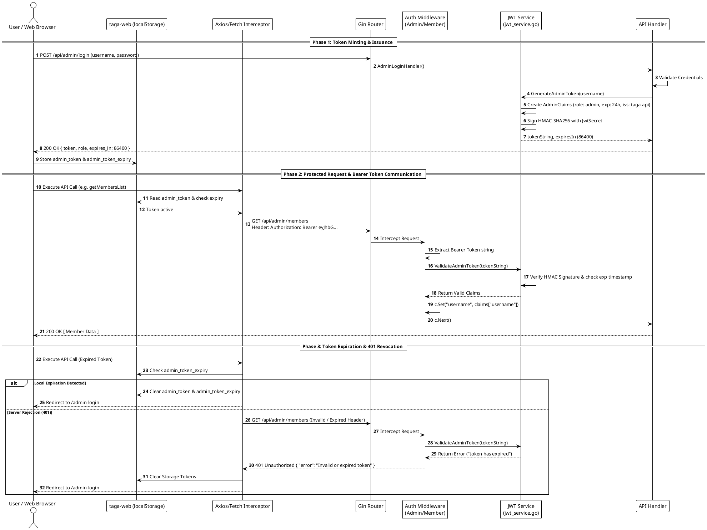

# Security Architecture & Design Specification: `taga-api` & `taga-web`

This document details the security architecture, JWT minting and token lifecycle, client-side persistence and communication pipeline, middleware execution pipeline, Swagger OpenAPI annotations, configuration settings, and Security Architect recommendations for **NAMMATAGA** (`taga-api` and `taga-web`).

---

## 1. Security Architecture Overview

The system uses a **Role-Based Access Control (RBAC)** architecture powered by the Go Gin Web Framework on the backend (`taga-api`) and React (TypeScript) with Axios/Fetch on the frontend (`taga-web`). The application segregates access into three primary security zones:

1. **Public Zone**: Unauthenticated endpoints accessible by general web clients (e.g., public info, events, gallery, public resources, Razorpay webhooks).
2. **Member Zone**: Endpoints requiring a valid `RoleMember` ("member") JWT token issued upon member login (e.g., member profile, notifications, subscription details, grievances).
3. **Admin Zone**: Endpoints requiring a valid `RoleAdmin` ("admin") JWT token issued upon administrator login (e.g., member management, content updates, excel exports, backup & restore).

```
 +---------------------------------------------------------------------------------------------------+
 |                                      INCOMING HTTP REQUEST                                        |
 +---------------------------------------------------------------------------------------------------+
                                                  |
                                                  v
 +---------------------------------------------------------------------------------------------------+
 | 1. CORS Middleware (cors.New)                                                                     |
 |    - Validates Origin against AllowedOrigins (Production whitelist vs Dev wildcard '*')          |
 |    - Enforces allowed headers: Authorization, Content-Type, Origin, Accept                         |
 +---------------------------------------------------------------------------------------------------+
                                                  |
                                                  v
 +---------------------------------------------------------------------------------------------------+
 | 2. Structured Logging Middleware (GinZapLogger)                                                   |
 |    - Captures request metadata, client IP, latency, HTTP method, and path                          |
 +---------------------------------------------------------------------------------------------------+
                                                  |
                                                  v
 +---------------------------------------------------------------------------------------------------+
 | 3. Gin Engine Router (router.SetupRouter())                                                       |
 |    - Matches request path to route definition and route group                                      |
 +---------------------------------------------------------------------------------------------------+
                           /                                      \
                          /                                        \
                         v                                          v
 +-----------------------------------+                    +------------------------------------+
 | Public Routes (No Auth)           |                    | Protected Route Groups             |
 | - /api/public/*                   |                    | - /api/member/*                    |
 | - /api/events/*                   |                    | - /api/payments/*                  |
 | - /api/webhook/razorpay           |                    | - /api/admin/*                     |
 +-----------------------------------+                    +------------------------------------+
                   |                                                        |
                   v                                                        v
         [Execute Handler]                                +------------------------------------+
                                                          | Auth Middleware                    |
                                                          | (AdminAuth / MemberAuth)           |
                                                          | 1. Extract Bearer Token            |
                                                          | 2. Validate Signature (HS256)      |
                                                          | 3. Check Expiration & Issuer       |
                                                          | 4. Validate Required Role          |
                                                          | 5. Inject Claims into Gin Context  |
                                                          +------------------------------------+
                                                                    |                 |
                                                               Valid|                 |Invalid
                                                                    v                 v
                                                          [Execute Handler]   [401 Unauthorized]
```

---

## 2. JWT Minting, Storage & Communication Lifecycle

The JWT token lifecycle spans both backend token minting and frontend token storage, injection, and session management.

```
 +------------------+             +-------------------+             +---------------------+
 |   taga-web UI    |             |   taga-api Auth   |             |  Protected Handlers |
 +------------------+             +-------------------+             +---------------------+
          |                                 |                                  |
          |--- 1. POST Credentials -------->|                                  |
          |    (/admin/login or /member/login)|                                |
          |                                 |--- 2. Mint & Sign JWT (HS256) -->|
          |<-- 3. Return JSON Token Payload-|   (token, role, expires_in)      |
          |    {token, role, expires_in}    |                                  |
          |                                 |                                  |
          |=== 4. Persist in localStorage ==|                                  |
          |    (token, expiry timestamp)    |                                  |
          |                                 |                                  |
          |--- 5. Intercepted API Request ------------------------------------>|
          |    Header: Authorization: Bearer <token>                           |
          |                                 |<-- 6. Validate Signature & Exp ---|
          |                                 |    Inject Claims into Context    |
          |<-- 7. Protected Data Response -------------------------------------|
```

### 2.1 Backend Token Minting (`taga-api`)

When a user submits login credentials (e.g. via [`AdminLoginHandler`](file:///home/ubuntu/code/github/raviautopilot/nammataga/taga-api/handler/admin_auth.go) or [`MemberLoginHandler`](file:///home/ubuntu/code/github/raviautopilot/nammataga/taga-api/handler/member_auth.go)), the backend validates the password hash/credentials and calls the cryptographic JWT service ([`jwt_service.go`](file:///home/ubuntu/code/github/raviautopilot/nammataga/taga-api/service/jwt/jwt_service.go)):

1. **Claim Building**:
   * **Admin Claims**: Encapsulated by `AdminClaims` in [`claims.go`](file:///home/ubuntu/code/github/raviautopilot/nammataga/taga-api/service/jwt/claims.go), including `Username`, `UserID`, `Role: "admin"`, and standard registered claims (`Issuer: "taga-api"`, `IssuedAt`, `ExpiresAt`).
   * **Member Claims**: Encapsulated by `MemberClaims` in [`claims.go`](file:///home/ubuntu/code/github/raviautopilot/nammataga/taga-api/service/jwt/claims.go), including `MemberID`, `Email`, `Name`, `Role: "member"`, and standard registered claims.
2. **Token TTL (Time-To-Live)**:
   * Determined dynamically by `GetTokenExpiry()` in [`constants.go`](file:///home/ubuntu/code/github/raviautopilot/nammataga/taga-api/service/jwt/constants.go).
   * **Production / Staging**: 24 Hours (`24 * time.Hour`).
   * **Development**: 7 Days (`168 * time.Hour`).
3. **HMAC-SHA256 Signing**:
   * Tokens are signed using `jwt.SigningMethodHS256` with `JwtSecret` loaded from [`config.json`](file:///home/ubuntu/code/github/raviautopilot/nammataga/taga-api/config/config.json).
4. **Response Payload**:
   * The endpoint returns a JSON response containing `token` (encoded string), `role` (`"admin"` or `"member"`), and `expires_in` (duration in seconds, e.g., `86400`).

```json
{
  "status": "success",
  "token": "eyJhbGciOiJIUzI1NiIsInR5cCI6IkpXVCJ9...",
  "role": "admin",
  "expires_in": 86400
}
```

### 2.2 Client-Side Storage & Lifecycle Management (`taga-web`)

Upon receiving a successful login response, the frontend (`taga-web`) immediately stores the token and metadata in the browser's `localStorage`:

* **Admin Storage Keys** (managed by [`adminContent.ts`](file:///home/ubuntu/code/github/raviautopilot/nammataga/taga-web/src/api/adminContent.ts#L94-L99)):
  * `admin_token`: Raw JWT string used for Bearer authentication.
  * `admin_role`: User role identifier (`"admin"`).
  * `admin_token_expiry`: Calculated absolute epoch timestamp (`Date.now() + expires_in * 1000`).
* **Member Storage Keys** (managed by [`member.ts`](file:///home/ubuntu/code/github/raviautopilot/nammataga/taga-web/src/api/member.ts#L69-L77)):
  * `member_token`: Raw JWT string.
  * `member_role`: User role identifier (`"member"`).
  * `member_token_expiry`: Absolute epoch expiration timestamp.
  * `user`: Stringified member profile metadata.

**Client-Side Expiration Check**:
Before issuing protected requests, helpers like `isTokenExpired()` in [`adminContent.ts`](file:///home/ubuntu/code/github/raviautopilot/nammataga/taga-web/src/api/adminContent.ts#L15-L19) evaluate `Date.now() > admin_token_expiry`. If expired, local storage is cleared (`adminLogout()`) and the user is redirected to `/admin-login`.

### 2.3 Outgoing Communication & Bearer Token Injection

To maintain authenticated communication with `taga-api`, all outgoing HTTP requests to protected endpoints pass through automated token injection layers:

1. **Admin API Communication (`authFetch`)**:
   * Implemented in [`adminContent.ts`](file:///home/ubuntu/code/github/raviautopilot/nammataga/taga-web/src/api/adminContent.ts#L46-L65).
   * Before executing `fetch()`, `authFetch` inspects `isTokenExpired()`. If valid, it injects the header:
     ```http
     Authorization: Bearer <admin_token>
     ```
2. **Member API Communication (Axios Interceptor)**:
   * Implemented in [`member.ts`](file:///home/ubuntu/code/github/raviautopilot/nammataga/taga-web/src/api/member.ts#L12-L21).
   * An Axios request interceptor inspects `localStorage.getItem("member_token")` and attaches it to every request header automatically:
     ```typescript
     API.interceptors.request.use((config) => {
       const token = localStorage.getItem("member_token");
       if (token) {
         config.headers.Authorization = `Bearer ${token}`;
       }
       return config;
     });
     ```

### 2.4 Backend Validation & 401 Automatic Revocation Loop

1. **Backend Token Verification**:
   * Requests hitting protected route groups pass through [`AdminAuthMiddleware`](file:///home/ubuntu/code/github/raviautopilot/nammataga/taga-api/middleware/admin_auth.go) or [`MemberAuthMiddleware`](file:///home/ubuntu/code/github/raviautopilot/nammataga/taga-api/middleware/member_auth.go).
   * The middleware strips the `Bearer ` prefix, calls `jwt_service.ValidateToken()`, verifies HMAC signature using `JwtSecret`, and asserts that claims match required roles and have not expired.
   * On success, claims are injected into the Gin context (`c.Set("username", ...)`, `c.Set("member_id", ...)`), allowing handlers to read identity data securely.
2. **Automatic 401 Interception & Cleanup**:
   * If the backend returns `401 Unauthorized` (e.g. due to server-side secret rotation or expired token), Axios/Fetch response interceptors (e.g. in [`member.ts`](file:///home/ubuntu/code/github/raviautopilot/nammataga/taga-web/src/api/member.ts#L24-L38)) capture the error, clear `localStorage` keys, and redirect the user back to login:
     ```typescript
     API.interceptors.response.use(
       (response) => response,
       (error) => {
         if (error.response?.status === 401) {
           localStorage.removeItem("member_token");
           localStorage.removeItem("member_token_expiry");
           localStorage.removeItem("user");
           window.location.href = "/member-login";
         }
         return Promise.reject(error);
       }
     );
     ```

---

## 3. Middleware Execution Pipeline & Order

| Order | Layer / Middleware | Scope | Description & Security Function |
| :---: | :--- | :--- | :--- |
| **1** | CORS Middleware (`cors.New`) | Global | Validates origin against whitelist (`AllowedOrigins`), handles OPTIONS preflight, permits `Authorization` headers. |
| **2** | Zap Logger (`GinZapLogger`) | Global | Logs request method, URL path, status, latency, client IP, and user-agent. |
| **3** | Gin Engine Router (`router.SetupRouter()`) | Global | Delegates to domain route files (`public_routes.go`, `member_routes.go`, `payment_routes.go`, `admin_routes.go`, `static_routes.go`). |
| **4** | Unauthenticated Handlers | Public Routes | Direct execution for `/`, `/health`, `/api/public/*`, `/api/webhook/*` without authentication headers. |
| **5** | Auth Minting Routes | Login Endpoints | Handlers `/api/member/login` and `/api/admin/login` verify credentials and issue signed JWT tokens. |
| **6** | `middleware.MemberAuthMiddleware()` | Member Route Group | Inspects `Authorization: Bearer <token>`, validates member claims, injects `member_id`, `member_email`, `member_name`, `role` into Gin context. |
| **7** | `middleware.AdminAuthMiddleware()` | Admin Route Group | Inspects `Authorization: Bearer <token>`, validates admin claims, verifies `role == "admin"`, injects `username`, `userID`, `role` into Gin context. |

---

## 4. PlantUML Architecture & Sequence Diagrams

### 4.1 PlantUML Component Diagram: Security Architecture



---

### 4.2 PlantUML Sequence Diagram: Full End-to-End JWT Minting & Bearer Flow



---

## 5. Swagger (OpenAPI) Security Annotations

Swagger documentation in `taga-api` uses annotations provided by `swaggo/swag`.

### 5.1 Global Security Definition
The global API security scheme is defined at the top of [`taga-api/router/router.go`](file:///home/ubuntu/code/github/raviautopilot/nammataga/taga-api/router/router.go#L20-L23):

```go
// @securityDefinitions.apikey BearerAuth
// @in header
// @name Authorization
// @description Type "Bearer" followed by a space and the JWT token.
```

* **`@securityDefinitions.apikey`**: Defines an API key authentication scheme named `BearerAuth`.
* **`@in header`**: Instructs Swagger UI to pass the credential in HTTP Request Headers.
* **`@name Authorization`**: Sets the header key to `Authorization`.

### 5.2 Handler Security Annotation
To declare that an individual API route requires JWT authorization, add `@Security BearerAuth` to handler docstrings (e.g. in [`taga-api/handler`](file:///home/ubuntu/code/github/raviautopilot/nammataga/taga-api/handler)):

```go
// GetMembersList retrieves all registered members
// @Summary List Members
// @Description Retrieve a list of members filtered by district or status
// @Tags Admin
// @Accept json
// @Produce json
// @Security BearerAuth
// @Success 200 {array} model.Member
// @Failure 401 {object} map[string]string "Unauthorized"
// @Router /api/admin/members [get]
func GetMembersList(c *gin.Context) {
    // Handler implementation
}
```

### 5.3 Generating & Serving Swagger Spec
1. Run `swag init` in `taga-api/` to scan annotations and regenerate `docs/swagger.json` and `docs/swagger.yaml`.
2. [`taga-api/router/router.go`](file:///home/ubuntu/code/github/raviautopilot/nammataga/taga-api/router/router.go#L274) mounts the UI handler:
   ```go
   r.GET("/swagger/*any", ginSwagger.WrapHandler(swaggerFiles.Handler))
   ```
3. Access Swagger UI at `https://<domain>/swagger/index.html` and click **Authorize** to input `Bearer <jwt_token>`.

---

## 6. File & Configuration Responsibility Matrix

| File Path | Component | Core Security Responsibility |
| :--- | :--- | :--- |
| [`taga-api/config/config.json`](file:///home/ubuntu/code/github/raviautopilot/nammataga/taga-api/config/config.json) | Backend Config | Stores `jwt_secret` and environment mode (`development`/`staging`/`production`). |
| [`taga-api/service/jwt/constants.go`](file:///home/ubuntu/code/github/raviautopilot/nammataga/taga-api/service/jwt/constants.go) | Backend Service | Defines `RoleAdmin` ("admin"), `RoleMember` ("member"), and environment-based TTL duration rules. |
| [`taga-api/service/jwt/claims.go`](file:///home/ubuntu/code/github/raviautopilot/nammataga/taga-api/service/jwt/claims.go) | Backend Service | Defines `AdminClaims` and `MemberClaims` structs extending `jwt.RegisteredClaims`. |
| [`taga-api/service/jwt/jwt_service.go`](file:///home/ubuntu/code/github/raviautopilot/nammataga/taga-api/service/jwt/jwt_service.go) | Backend Service | Mints HMAC-SHA256 signed tokens (`GenerateAdminToken`, `GenerateMemberToken`), parses and validates claims (`ValidateToken`). |
| [`taga-api/middleware/admin_auth.go`](file:///home/ubuntu/code/github/raviautopilot/nammataga/taga-api/middleware/admin_auth.go) | Backend Guard | Admin authorization middleware. Extracts Bearer token, validates admin claims, injects `username` and `role` into Gin context. |
| [`taga-api/middleware/member_auth.go`](file:///home/ubuntu/code/github/raviautopilot/nammataga/taga-api/middleware/member_auth.go) | Backend Guard | Member authorization middleware. Extracts Bearer token, validates member claims, injects `member_id`, `member_email`, `member_name`, `role`. |
| [`taga-api/router/router.go`](file:///home/ubuntu/code/github/raviautopilot/nammataga/taga-api/router/router.go) | Backend Router | Central route setup, CORS origins whitelist, attaches auth middlewares to route groups, serves Swagger UI. |
| [`taga-web/src/api/adminContent.ts`](file:///home/ubuntu/code/github/raviautopilot/nammataga/taga-web/src/api/adminContent.ts) | UI API Layer | Handles admin login response, persists `admin_token` & `admin_token_expiry` to `localStorage`, wraps requests with `authFetch` to attach Bearer header. |
| [`taga-web/src/api/member.ts`](file:///home/ubuntu/code/github/raviautopilot/nammataga/taga-web/src/api/member.ts) | UI API Layer | Handles member login response, configures Axios request interceptor for Bearer token injection and Axios response interceptor for 401 logout redirect. |

---

## 7. Security Architect Recommendations & Improvements

> [!WARNING]
> The following security enhancement recommendations should be prioritized to strengthen `taga-api` and `taga-web` against production security threats.

### 7.1 Eliminate Hardcoded Fallback JWT Secrets
* **Current Issue**: In [`jwt_service.go`](file:///home/ubuntu/code/github/raviautopilot/nammataga/taga-api/service/jwt/jwt_service.go#L18), if `cfg.JwtSecret` is empty, it falls back to `"ilovetaga"`.
* **Risk**: If configuration loading fails in production, the API defaults to a publicly exposed secret key, allowing attackers to forge arbitrary admin tokens.
* **Recommendation**: Enforce a strict startup check in `config.InitConfig()`:
  ```go
  if (cfg.Environment == "production" || cfg.Environment == "staging") && cfg.JwtSecret == "" {
      log.Fatalf("FATAL SECURITY ERROR: JwtSecret must be configured in %s environment", cfg.Environment)
  }
  ```

### 7.2 Implement Rate Limiting Middleware
* **Current Issue**: Login endpoints (`/api/admin/login`, `/api/member/login`, `/api/auth/forgot-password`) lack request rate limiting.
* **Risk**: Vulnerable to credential stuffing and brute-force password guessing attacks.
* **Recommendation**: Attach an IP-based rate limiter (e.g. `golang.org/x/time/rate`) to authentication routes:
  ```go
  authGroup.Use(middleware.RateLimiter(5, time.Minute)) // Max 5 attempts per minute
  ```

### 7.3 Token Blacklisting / Instant Revocation Mechanism
* **Current Issue**: JWT tokens are stateless and remain valid until their expiration time (`exp`). Logout functions clear client `localStorage` but cannot invalidate issued tokens server-side.
* **Risk**: Stolen tokens remain active even after a user logs out or changes their password.
* **Recommendation**: Integrate a Redis-backed token revocation list (JTI / Token hash blacklist) checked inside `AdminAuthMiddleware` and `MemberAuthMiddleware`.

### 7.4 OWASP Security Headers Middleware
* **Current Issue**: Default HTTP responses lack security headers such as `X-Frame-Options`, `X-Content-Type-Options`, and `Strict-Transport-Security`.
* **Recommendation**: Add a Security Headers middleware to `router.go`:
  ```go
  r.Use(func(c *gin.Context) {
      c.Header("X-Frame-Options", "DENY")
      c.Header("X-Content-Type-Options", "nosniff")
      c.Header("X-XSS-Protection", "1; mode=block")
      c.Header("Strict-Transport-Security", "max-age=31536000; includeSubDomains")
      c.Next()
  })
  ```
